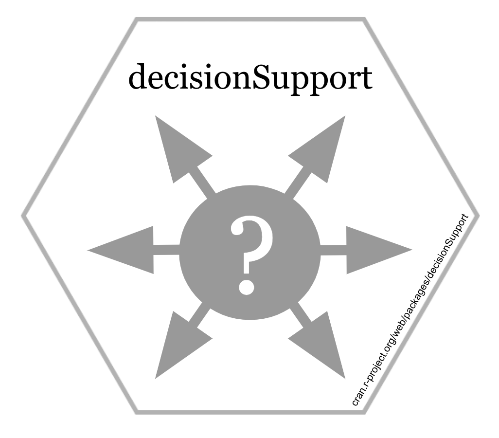

# {width=40%} {-#header}

**Welcome to Decision Analysis and Forecasting for Agricultural Development**

# This course

In this course, we will provide an overview of methods we can use to study ... . If you do not know what that is you've come to the right place. This course was developed for M.Sc. students in [Crop Sciences](https://www.lf.uni-bonn.de/en/studying/master/npw) at the [University of Bonn](https://www.uni-bonn.de/startpage?set_language=en), but the materials are also intended for a general audience interested in applying these tools.

After some introduction of the subject matter, i.e. ... , much of this course will consist of practical application of the [`decisionSupport`](https://cran.r-project.org/web/packages/decisionSupport/index.html) package in the [R](https://www.r-project.org/) programming language.

## Objectives

In this course, we aim to provide you with the following skills and experiences:

* ...
* Understanding of how to use some staple tools of R code development
* Ability to use `R` for ...
* Ability to use `decisionSupport` functions for generating and running decision simulations ...

## Lecture schedule

```{r echo = FALSE, results = 'asis'}
library(knitr)
library(pander)
schedule<-read.csv("schedule.csv")
kable(schedule)
```

## Performance assessment

In this module, there will be no exam, but you'll still have to put in a bit of effort to pass and get a good grade here. Over the course of the semester, we'll be developing a `learning logbook`. This will be an [Rmarkdown](https://rmarkdown.rstudio.com/) document ([here's an example of what this is](https://static-content.springer.com/esm/art%3A10.1007%2Fs10584-020-02862-8/MediaObjects/10584_2020_2862_MOESM1_ESM.pdf)), where you'll record your learning and your coding work. This document will contain short thematic chapters on the lecture contents, as well as the code you'll produce and the outputs you'll generate. The final chapters will contain some discussion of the results you'll have obtained. This document will be evaluated, and it will be the major determinant of your final grade (participation in class will also count for some of the grade).

## House rules

In this course, we'll gradually work our way into the `decisionSupport` package. At the end of the semester, you should be able to apply state-of-the-art Decision Analysis. Yet even if it's not your ambition to become a  decision analyst, you'll have picked up a bunch of useful skills along the way. We'll try to teach you how to use some staple programming tools and techniques that can be used for all kinds of programming challenges. These will include the use of github and Rmarkdown, as well the the ability to create, manipulate and use R functions and packages.

What is expected of you is to be engaged in this class, and to diligently complete the assignments you receive. Learning things in R requires practice, through which many things that seem cumbersome at first eventually become almost automatic. We are hopeful that the things you'll get exposed to in this class will be assets in your scientific (or other) career. So please take the materials seriously!

# The tools we use

This course not only aims to teach you things about Decision Analysis and related topics - it also provides hands-on exercises to illustrate the functions of the `decisionSupport` package. You should also document everything you learn in a `learning logbook`. For all of these practical components, we need tools. `decisionSupport` is an R package, so we'll need [R](https://www.r-project.org/), which is most comfortably operated through the [RStudio](https://rstudio.com/) interface.

We could simply start running [RStudio](https://rstudio.com/) on our local computer, save our files somewhere on our hard drive and generally operate the way we usually work with our computer. But this is not how real programmers work, and since this is what we're trying to be, we should familiarize ourselves with some code development tools that such people use. We'll therefore introduce you to [git](https://git-scm.com/) and [github](https://github.com/), which are very useful for keeping code organized and secure (and to share it with the world, if that's what you want to do). 

Finally, we want to show you how to properly document what you do in R, and how to compile professional-looking reports of your work. This is what [Rmarkdown](https://rmarkdown.rstudio.com/) helps us do. Some of this may be a bit confusing in the beginning, but you'll probably learn to appreciate the value of these tools, as we keep using them in this module.

## R and RStudio

The first video shows you how to install and run [R](https://www.r-project.org/) and [RStudio](https://rstudio.com/)

<iframe width="560" height="315" src="https://www.youtube.com/embed/WT3tKlzCZgo" frameborder="0" allowfullscreen></iframe>

## git and Github

Now we look at the programming version control environment [git](https://git-scm.com/) and the interface [github](https://github.com/), which we use to access these features.

<iframe width="560" height="315" src="https://www.youtube.com/embed/S98XJTyIVaY" frameborder="0" allowfullscreen></iframe>

## Rmarkdown

Now let's check out [Rmarkdown](https://rmarkdown.rstudio.com/), a powerful tool that allows making fancy reports, websites etc. out of our R code. You're already looking at an example, by the way. This website was produced with Rmarkdown (and it wasn't hard at all)!

<iframe width="560" height="315" src="https://www.youtube.com/embed/hh4wyP8tvkI" frameborder="0" allowfullscreen></iframe>

Now we're equipped with all the basic tools for this course. We'll start using them pretty soon. Below you'll find occasional references to your `learning logbook`. This is supposed to be produced with Rmarkdown, with subsequent versions of it stored on github.
