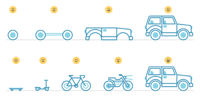

# Lecture 6: Building Decision Models {#decision_models}

Welcome to lecture 6 of **Decision Analysis and Forecasting for Agricultural Development**. We will walk through brief examples and offer the scripts. Feel free to bring up any questions or concerns in the Slack or to [Dr. Cory Whitney](mailto:cory.whitney@uni-bonn.de?subject=[Lecture_3]%20Decision%20Analysis%20Lecture) or the course tutor.

-	Making a solid business case for the model before programming

-	Step1. Start simple i.e. with a skateboard … then move on to other steps

Causal model / diagram / Impact pathway / Theory of change

## Brief examples
 
 - Vietnam
 - Uganda
 - Calluna
 
 ## Further Reading 
 
-  The Flaw of Averages: https://hbr.org/2002/11/the-flaw-of-averages
 
