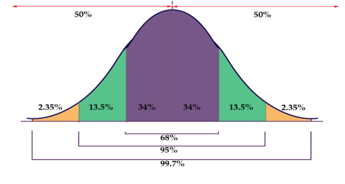

##  Bayesian Analysis or Confronting expert calibrated models with data {#practical}

Welcome to the lecture on Bayesian modeling with me, [Dr. Katja Schiffers](https://www.gartenbauwissenschaft.uni-bonn.de/author/dr.-katja-schiffers/). Even though we only start implementing these methods in our group for decision analysis, we do not want to withhold this approach from you. Originally, I prepared this introduction for a seminar on the analysis of experimental data, so the focus is more on comparing frequentist and Bayesian statistics than on decision models.   

The following text heavily relies on a very well-written article ["Short introduction to Bayesian statistics with R for ornithologists"](https://www.researchgate.net/profile/Ommo-Hueppop/publication/326111028_A_short_introduction_to_bayes_statistics_with_R_for_ornithologists/links/5b3db7a0aca272078511a8da/A-short-introduction-to-bayes-statistics-with-R-for-ornithologists.pdf) (2016) by Fränzi Korner-Nievergelt & Ommo Hüppop in 'Die Vogelwarte'. At the end of the lecture, you will know 
 
 - the principle of Bayesian statistics,
 - ways to apply it using the R package 'bmrs', and
 - the differences between frequentist and Bayesian statistics regarding the interpretation of results.

---------------
### Bayes' theorem

No introduction to Bayesian statistics is complete without Bayes' theorem. Thomas Bayes was an English clergyman, philosopher, and statistician who, in 1763 published a manuscript entitled "An essay towards solving a problem in the doctrine of chances." In this work, he describes how, based on existing knowledge and additional observations **X**, the probability can be calculated that a hypothesis **H** is true:

$$P(H|X) = \frac {P(X|H)×P(H)}{P(X)}$$

In words, the probability (P) that the hypothesis is true, given the observed data (P(H|X), **a-posteriori** knowledge), is equal to the probability of observing the data, assuming the hypothesis is true (P(X|H), **likelihood**), times the prior probability that the hypothesis is true before observing the data (P(H), **a-priori** knowledge or **prior**), divided by the probability of observing the data regardless of any assumptions about the hypothesis (P(X), normalization constant).

It is important to note that hypotheses are expressed as parameter values. For example, if our hypothesis is that the mean of a dependent variable is greater under treatment A than under treatment B, we would calculate the probability for the parameter mean(A) - mean(B) and obtain the probability that it is greater than zero.


### The principle of Bayesian statistics

In Bayesian statistics, this idea is used to combine prior knowledge from experts/literature (P(H)) with the information contained in newly collected data X to generate the updated a-posteriori knowledge. We also see that as a result, we obtain the probability of our hypothesis. This is much more digestible and closer to our "normal" way of thinking than interpreting a p-value: "The probability of finding data as extreme as this or more extreme, if the null hypothesis is true."


**Excursion: Probability distributions**

To represent probabilities, such as prior knowledge, probability distributions are used. In the following figure, you can see such a probability distribution: the higher the density, the more likely the parameter value plotted on the x-axis. The total area under the curve always adds up to 1 (exactly some parameter value must always be true).    



So how do we calculate this probability? Unfortunately, it's usually not as straightforward as it seems. While we can usually calculate the likelihood (this is also done in frequentist statistics to determine the parameter values of our models) and establish our a-priori knowledge through a probability distribution, things get tricky with the P(X) part, the probability of the data, at least once we no longer have very simple models. To do this, we would have to integrate the probability of the data over all possible parameter values, and this is often not possible. Fortunately, this problem can be overcome with a simulation technique developed in the 1980s and 1990s:

#### MCMC - Markov Chain Monte Carlo

MCMC methods can approximate probability distributions (in this case, P(H|X)) that cannot be analytically computed. The most intuitive and quite ingenious explanation I found for this is by Michael Franke on his Github page at https://michael-franke.github.io/intro-data-analysis/Ch-03-03-estimation-algorithms.html. Here are some parts of it:


**How the Apples Get to the Trees**

Every year in spring, Mother Nature sends out her children to distribute apples on the apple trees. For each tree, the number of apples should be proportional to the number of leaves: Giant Ralph with twice as many leaves as Skinny Daniel should also have twice as many apples in the end. So if there are a total of $n_a$ apples, and $L(t)$ is the number of leaves on tree $t$, each tree should receive $A(t)$ apples.

$$A(t) = \frac {L(t)}{\sum L(t')}n_a$$ 

The problem is that Mother Nature cannot calculate $\sum L(t')$ (the normalization constant), so she doesn't know how many leaves all the trees have together.

The children (Markov chains) can count, however. They can't visit all the trees and they can't remember the numbers for very long, but they can do it for two trees at a time. Here's what they do: they each start at a random tree (parameter value), already put an apple in it, count the leaves $L(t_1)$ there and then look for a nearby tree from which they can also count the leaves $L(t_2)$ (the denominator of our distribution). If the number of leaves in the second tree is higher, they will definitely go there and put an apple in it. If it's lower, they will only go there with a probability of $L(t_2)/L(t_1)$ and put an apple there. They keep walking back and forth between the trees, and in the end, the apples are roughly evenly distributed. The frequency of visits by the children has therefore approximated the desired distribution (which Mother Nature couldn't calculate)!

MCMC methods do the same thing: an MCMC chain randomly draws values for the model parameters and computes Result1 = Likelihood of the data * Prior using them. Then it draws values randomly around the first ones and computes Result2 = Likelihood of the data * Prior for them. If Result2 is higher than Result1, it jumps there and draws new parameter values from there. If Result2 is lower, it only jumps there with a probability of Result2/Result1. Then, values are drawn randomly again, and so on. In the following figure, successful jumps are represented by blue arrows and rejected jumps by green arrows.

  


If this process is continued long enough, the distribution of the blue dots approaches the posterior probability distribution of the parameters that we want: We have combined a priori knowledge with the information contained in the newly collected data to successfully obtain posterior knowledge!

### A (somewhat contrived) example.

We need to decide which chicken breed we want to keep in our orchard. We already have 3 Kraienköppe and 6 Niederrheiner. We prefer the Niederrheiner because they are less aggressive, but the Kraienköppe seem to have a slightly higher egg-laying performance. Is it really advisable to choose Kraienköppe because of this tendency?

**1: Definition of the A-priori-probability distribution**

We inquire about the egg production of the two breeds and learn that Niederrheiners lay between 190 and 210 eggs per year, while Kraienkoppes lay between 200 and 220. Accordingly, we formulate our prior probability distributions:

```{r}
library(brms, warn.conflicts=F, quietly=T)
# We define 2 normal distributions using the function set_prior, one with a mean of 200 and a standard deviation of 1.5, and another with a mean of 210 and a standard deviation of 1.5. We specify under 'coef' which parameters in the model that we later formulate these priors belong to.
priors <- c(set_prior("normal(200, 5)", coef = "rasseN"), set_prior("normal(210, 5)", coef = "rasseK"))

#That's how we can plot them, to get a feeling for the priors:
curve(dnorm(x, 200, 5), from = 170, to = 230, xlab="egg production", ylab="density")

```

**2. Collecting new data**

Now we report our own observations of the egg-laying performance of the 3 Kraienköppe and 6 Niederrheiners from the previous year:

```{r}
rasse <- c("K", "K", "K", "N", "N", "N", "N", "N", "N")
ll <- c(225, 222, 221, 219, 219, 216, 221, 218, 217)
daten <- data.frame(rasse=rasse, ll=ll)
```

**3. Combining the prior distribution with the data to obtain the posterior distribution**

To estimate the posterior distribution, we use the 'brm' function of the 'brms' package. As we know from other evaluations, we first formulate our model, namely that the egg-laying performance ll depends on the breed. The -1 in the model formula causes the model to estimate the mean egg-laying performance for both breeds rather than just the mean for the first breed and the difference to it. Under 'data', we enter our own collected data and under 'prior', we define the above priors. The 'silent' argument determines how much information is output to the console when the MCMC chains start running. Depending on the complexity of the model, these simulations can take several seconds or minutes.

```{r, results='hide'}
legeleistung <- brm(ll ~ rasse -1, data = daten, prior = priors, silent = 2)

```
  
**4. Interpretation**

The above code has performed the MCMC simulation and we can now examine the posterior distributions for the laying performance of the chicken breeds:

```{r}
# That's how to print the summary
summary(legeleistung)
```
The summary first shows us our inputs and some information about the Markov chains. Most interesting to us are, of course, the estimates for rasseK and rasseN and their credibility intervals. As you can see, the confidence intervals overlap: the lower value of rasseK (l-95%) is about 218, which is smaller than the upper value (u-95%) of about 219 for rasseN, which lays fewer eggs.

Sigma is the estimated standard deviation of the assumed normal distribution and is less relevant to us here.

```{r}
plot(legeleistung)
```

In the figure, the results are even easier to interpret. On the left, you can see the a-posteriori distributions for both breeds (note that the x-axes of the top two distributions are not aligned). To the right of that are the dynamics of the Markov chains.

From the a-posteriori distributions, we could now also calculate the exact probability that the egg-laying performance really is different. However, since we have already seen that the credibility intervals overlap, we stick to our preference for the Niederrheiners, even though it is not ruled out that they lay a few eggs less.

### Frequentist	versus Bayesian

| Frequentis | Bayesian |
|----------------|---------------|
Probability of data, in relation to hypothesis| only yes/no answer	|Probability of hypotheses|
Confidence interval: in which interval do we expect 95% of the means of further random samples of the same sample size	|Credibility interval: in which range of values does the true population mean lie with a probability of 95%|
Assumption that there is **one** 'true' value, but observations lead to a distribution|	Assumption that the observed values are true and have an intrinsic variance

The easier interpretability of Bayesian analyses is best illustrated by the following figure:

![Source: Korner-Nievergelt und Hüppop (2016). Five possible results of estimating an effect, such as the difference in yield with different fertilization. The dots indicate the estimated differences, the vertical bars indicate the 95% uncertainty intervals (confidence interval or credible interval). The results of the corresponding null hypothesis test are shown in the first row. The second row shows the posterior probability for the hypothesis that the effect is "economically relevant". The background color distinguishes "economically relevant" (orange) from "economically not relevant" (light blue) effect sizes schematically.](images/effektgroesse.png)

An uncritical frequentist approach would result in: "The effect in group/treatment A and E is significant, so we will use the tested fertilizer for those groups. There seems to be no effect in the other groups."

However, there is an important effect in group B as well, and even though the effect in group E is statistically significant, the effect size on yield is so small that it probably does not make economic sense to fertilize additionally.

The results of the Bayesian analysis (i.e., the probabilities for the hypothesis that there is an effect) much more directly reflect these interpretations.
