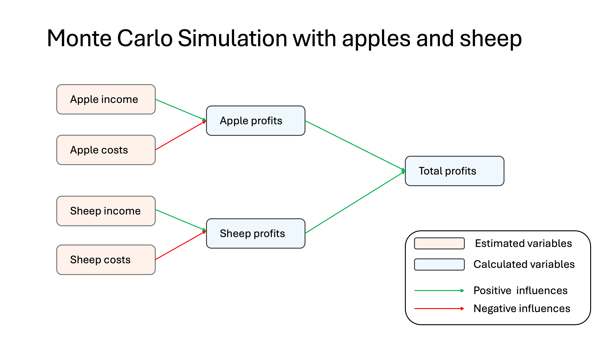

## Seminar 6: Model Programming {#model_programming} 
<!-- reference with [Model programming](#model_programming) -->

Welcome to the model programming seminar of **Decision Analysis and Forecasting for Agricultural Development**. In this seminar we will look into different options for model programming in the `R` programming environment [@R-base]. In case you have not already installed `R` and `RStudio` you may want to go back to the [Using R and Rstudio](#r_rstudio) seminar and follow the instructions there. Feel free to bring up any questions or concerns in the Slack or to [Dr. Cory Whitney](mailto:cory.whitney@uni-bonn.de?subject=[Seminar_4]%20Decision%20Analysis%20Lecture) or the course tutor.

Remember to start simple then move on to other steps, make sure that you always have a working model at each of the steps in the process, i.e. starting with a skateboard rather than a car part as in this example from [MetaLab](https://twitter.com/metalab).

### Monte Carlo Simulation of Apples and Sheep Agroforestry 

Follow this example for a simple first Monte Carlo in base R. 

{width=50%}

<iframe width="560" height="315" src="https://www.youtube.com/embed/Wj49RrvjQ5M" frameborder="0" allowfullscreen></iframe>
