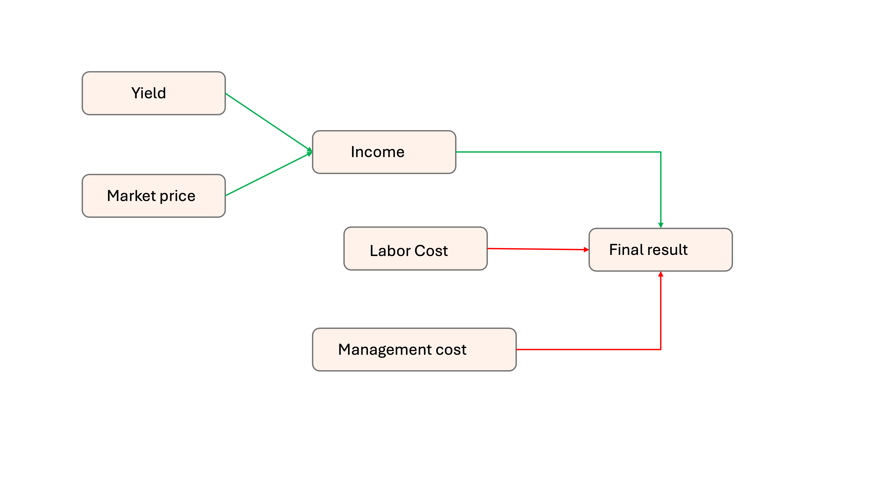

## Seminar 7: Model Programming continued {#model_programming_cont} 
<!-- reference with [Model programming](#model_programming_cont) -->

Welcome to the second seminar on model programming **Decision Analysis and Forecasting for Agricultural Development**. In this seminar we will look into different options for model programming in the `R` programming environment [@R-base]. In case you have not already installed `R` and `RStudio` you may want to go back to the [Using R and Rstudio](#r_rstudio) seminar and follow the instructions there. Feel free to bring up any questions or concerns in the Slack or to [Dr. Cory Whitney](mailto:cory.whitney@uni-bonn.de?subject=[Seminar_4]%20Decision%20Analysis%20Lecture) or the course tutor.


### Decision analysis with the decisionSupport package

As we have discussed in previous lectures, when deciding on intervention in complex systems, many of the variables decision makers need to consider are difficult or impossible to precisely quantify. The `decisionSupport` package [@R-decisionSupport] can make use of uncertainty around these relationships and implement a Monte Carlo simulation, which generates a large number of plausible system outcomes. The model procedure draws random numbers for each input variable, which are drawn from specified probability distributions. The method requires two inputs to the `mcSimulation` function:

1)	an R function that predicts decision outcomes based on the variables named in a separate data table. This R function is customized by the user to address a particular decision problem.  

2)	an input table (normally in `comma separated values` format, ending in `.csv`) specifying the names and probability distributions for all variables used in the decision model. These distributions aim to represent the full range of possible values for each component of the model.  

The `mcSimulation` function from the `decisionSupport` package conducts a Monte Carlo analysis with repeated model runs based on probability distributions for all uncertain variables. The data table and model are customized to fit the particulars of a specific decision.

### Building a decision model as an R function

We have already built some simple models in the [Decision Models](#decision_models) lecture and the [Model programming](#model_programming) seminar. 

First we generate a model as a function. We use the `decisionSupport` functions `vv()` to produce time series with variation from a pre-defined mean and coefficient of variation, `chance_event()` to simulate whether events occur and `discount()` to discount values along a time series.

### decisionSupport package in R

We have just learned about the processes and methods of generating [Decision Models](#decision_models). Now we can explore some of the packages that we commonly use in `R`. The main package that our team uses for simulations is the `decisionSupport`. In order to use the standard tools for running these models in the R environment you will need to load the `decisionSupport` library. Use the `install.packages` function, i.e. `install.packages("decisionSupport")`. 

```{r}
library(decisionSupport)
```


### Building the model 

{width=50%}

Here we generate an input table to feed the model function. Update this to include the management cost variable in the graphical impact pathway above. Call your new variable `"Management_cost"`, make the lower bound `100` and the upper bound `2000`, make the distribution `"posnorm"`, make the label `"Management cost (USD/ha)"` and make the description `"Management costs in a normal season"`.

```{r input_table, exercise=TRUE}
input_estimates <- data.frame(variable = c("Yield", "Market_price", "Labor_cost"),
                    lower = c(6000, 3, 500),
                    median = NA,
                    upper = c(14000, 8, 1000),
                    distribution = c("posnorm", "posnorm", "posnorm"),
                    label = c("Yield (kg/ha)", "Price (USD/kg)", "Labor cost (USD/ha)"),
                    Description = c("Yield in a sweet cherry farm under normal conditions",
                                    "Price of sweet cherry in a normal season",
                                    "Labor costs in a normal season"))

input_estimates
```

```{r input_table-solution}
input_estimates <- data.frame(variable = c("Yield", "Market_price", "Labor_cost", "Management_cost"),
                    lower = c(6000, 3, 500, 100),
                    median = NA,
                    upper = c(14000, 8, 1000, 2000),
                    distribution = c("posnorm", "posnorm", "posnorm", "posnorm"),
                    label = c("Yield (kg/ha)", "Price (USD/kg)", "Labor cost (USD/ha)", "Management cost (USD/ha)"),
                    Description = c("Yield in a sweet cherry farm under normal conditions",
                                    "Price of sweet cherry in a normal season",
                                    "Labor costs in a normal season", 
                                    "Management costs in a normal season"))

input_estimates
```

Here we use the `mcSimulation` function from the `decisionSupport` package to implement a model [@R-decisionSupport]. The model function that describes the graphical impact pathway. Add a new line of code that summarizes the `Labor_cost` and `Management_cost` into `overall_costs`, then subtract these from the `income` to calculate `final_result`. 

```{r chile-model, exercise=TRUE}

model_function <- function(){
  
  # Estimate the income in a normal season
  income <- Yield * Market_price
  
  # Estimate the final results from the model
  final_result <- income - Labor_cost
  
  # Generate the list of outputs from the Monte Carlo simulation
  return(list(final_result = final_result))
}

# Run the Monte Carlo simulation using the model function
example_mc_simulation <- mcSimulation(estimate = as.estimate(input_estimates),
                              model_function = model_function,
                              numberOfModelRuns = 800,
                              functionSyntax = "plainNames")

example_mc_simulation

```

```{r chile-model-solution}

model_function <- function(){
  
  # Estimate the income in a normal season
  income <- Yield * Market_price
  
  overall_costs <- Labor_cost + Management_cost
    
  # Estimate the final results from the model
  final_result <- income - overall_costs
  
  # Generate the list of outputs from the Monte Carlo simulation
  return(list(final_result = final_result))
}

# Run the Monte Carlo simulation using the model function
example_mc_simulation <- mcSimulation(estimate = as.estimate(input_estimates),
                              model_function = model_function,
                              numberOfModelRuns = 800,
                              functionSyntax = "plainNames")

example_mc_simulation

```

Here we show the results of a Monte Carlo simulation (800 model runs) for estimating the profits in sweet cherry orchards. 

Change the plot to a histogram by using the `method` argument in the `plot_distributions` function. 

```{r plot_distribution, exercise=TRUE}

plot_distributions(mcSimulation_object = example_mc_simulation,
                   vars = "final_result",
                   method = "boxplot_density",
                   old_names = "final_result",
                   new_names = "Outcome distribution for profits")

```

```{r plot_distribution-solution}

plot_distributions(mcSimulation_object = example_mc_simulation,
                   vars = "final_result",
                   method = "hist_simple_overlay",
                   old_names = "final_result",
                   new_names = "Outcome distribution for profits")

```

### Testing with `make_variables`

You could simply start further developing the decision model now, but since the model function will be designed to make use of variables provided to it externally (random numbers drawn according to the information in the data table), you will need to define sample values for all variables, if you want to test pieces of the function code during the development process. This can be done manually, but it's more easily accomplished with the following helper function `make_variables`:

```{r make_variables_function, exercise=TRUE}
make_variables <- function(est,n=1)
{ x<-random(rho=est, n=n)
    for(i in colnames(x)) assign(i,
     as.numeric(x[1,i]),envir=.GlobalEnv)
}
```

This function is not included in the ```decisionSupport``` package, because it places the desired variables in the global environment. This is not allowed for functions included in packages on R’s download servers.

Applying `make_variables` and `as.estimate` to the data table (with default setting `n=1`) generates one random number for each variable, which then allows you to easily test the code you are developing. Try running this function on your code as you build the decision function. This allows for testing the values within a model rather than running the full model.

Run the `make_variables` and `as.estimate` on the `input_estimates` input table that we created and then calculate the result of `Labor_cost + Management_cost` given a single random value for these variables. **Note that each time you run this code it generates a new random draw and produces a different number from within the range for the variables in the input table.**

```{r make_variables, exercise=TRUE}

make_variables(as.estimate(input_estimates))

Market_price

```

```{r make_variables-solution}

make_variables(as.estimate(input_estimates))

Labor_cost + Management_cost

```


### Next steps

Once you have followed and run the code above on your machine it is a good time to look through the outline of these procedures in the `decisionSupport` vignette on the CRAN called ['Applying the mcSimulation function in decisionSupport'](https://cran.r-project.org/web/packages/decisionSupport/vignettes/example_decision_function.html) [@fernandez_applying_2021]. This will show you how the tools can be applied for comparing decision outcomes. It runs a Monte-Carlo-based selection of sedimentation management strategies for a reservoir in the Upper Volta River Basin of Burkina Faso [@lanzanova_improving_2019]. Tip: If you want to play with this code you can find the [Rmarkdown file](https://raw.githubusercontent.com/eikeluedeling/decisionSupport/master/vignettes/example_decision_function.Rmd) and the [estimate table](https://raw.githubusercontent.com/eikeluedeling/decisionSupport/master/vignettes/example_input_table.csv) in the `decisionSupport` GitHub repository. 

Taken together, all these outputs allow an evaluation of the plausible range of net benefits that can be expected to arise from the decision. They provide a recommendation on which decision option should be preferred, and an appraisal of which input variables are responsible for most of the variation in the output distribution.

### Bonus: Bayesian modeling application 

Listen to this interview on Alex Andorra's podcast 'Learning Bayesian Statistics', [How to use Bayes in industry, with Colin Carroll](https://www.learnbayesstats.com/episode/3-2-how-to-use-bayes-in-industry-with-colin-carroll)

<!-- -	RSTAN, Other modeling programs - Betancourt’s work (selected blogs, talks, git repos, Stan, HCMC) -->
<!-- -	Yihui (markdown etc.) -->
<!-- -	Assignments:  -->
<!-- -	Rainforth, Tom. “Automating Inference, Learning, and Design Using Probabilistic Programming.” Doctor of Philosophy, University of Oxford, 2017. -->

### Causal model / diagram / Impact pathway / Theory of change

Before you start developing the decision model (an R function), open R and download and load the `decisionSupport` package.

```
install.packages("decisionSupport")
library(decisionSupport)
```

### Creating a model

The `mcSimulation` function from the `decisionSupport` package can be applied to conduct decision analysis [@R-decisionSupport]. The function requires three inputs:

1. an `estimate` of the joint probability distribution of the input variables. These specify the names and probability distributions for all variables used in the decision model. These distributions aim to represent the full range of possible values for each component of the model.
1. a `model_function` that predicts decision outcomes based on the variables named in a separate data table. This R function is customized by the user to address a particular decision problem to provide the decision analysis model.
1. `numberOfModelRuns`	indicating the number of times to run the model function.

These inputs are provided as arguments to the `mcSimulation` function, which conducts a Monte Carlo analysis with repeated model runs based on probability distributions for all uncertain variables. The data table and model are customized to fit the particulars of a specific decision.

### The `estimate`

To support the model building process we design an input table to store the `estimate` values. The table is stored locally as `example_decision_inputs.csv` and contains many of the basic values for the analysis. This table contains all the input variables used in the model. Their distributions are described by 90% confidence intervals, which are specified by lower (5% quantile) and upper (95% quantile) bounds, as well as the shape of the distribution. This example uses four different distributions:

1.	`const` – a constant value
1.	`norm` – a normal distribution
1.	`tnorm_0_1` – a truncated normal distribution that can only have values between 0 and 1 (useful for probabilities; note that 0 and 1, as well as numbers outside this interval are not permitted as inputs)
1.	`posnorm` – a normal distribution truncated at 0 (only positive values allowed)

For a full list of possible distributions, type `?random.estimate1d ` in your R console. When specifying confidence intervals for truncated distributions, note that approximately 5% of the random values should ‘fit’ within the truncation interval on either side. If there is not enough space, the function will generate a warning (usually it will still work, but the inputs may not look like you intended them to).

We have provided default distributions for all the variables used here, but feel free to make adjustments by editing the .csv file in a spreadsheet program. You can download the ['example_decision_inputs.csv'](https://raw.githubusercontent.com/CWWhitney/Decision_Analysis_Course/main/data/example_decision_inputs.csv) here and save it as a .csv file locally (from your web browser try: File > Save page as). In this example it is stored in the 'data' folder. Once you have downloaded the data you can run `example_decision_inputs <- read.csv("data/example_decision_inputs.csv")` in your console to make the following code work on your machine. Note that the input table that can be written or read from a .csv file and calculated with the `estimate_read_csv` function or converted to the correct format with the `as.estimate` function.

### The `model_function`

The decision model is coded as an R function which takes in the variables provided in the data table and generates a model output, such as the Net Present Value.

### Create a simple function

Here we define a simple model function that we call `example_decision_model`. It calculates profits as benefits minus costs and arbitrarily adds 500 to the result to arrive at `final_profits`. This simple example shows us how to use `function`, the results of which can be applied elsewhere. The most basic way to apply the library is to use the `mcSimulation` function to run our `example_decision_model`. Here we run it 100 times using inputs from the `example_decision_inputs.csv` table.

Update this model by adding `additional_benefits`, one of the variables from the `example_decision_inputs` data, to replace the 500 that was arbitrarily added to the profit and changing the number of model runs to 700.

```{r example_decision_model, exercise=TRUE}

example_decision_model <- function(x, varnames){
  profit <- benefits-costs

  final_profits <- profit + 500

  return(final_profits)

}

mcSimulation(estimate = as.estimate(example_decision_inputs),
                              model_function = example_decision_model,
                              numberOfModelRuns = 100,
                              functionSyntax = "plainNames")

```

```{r example_decision_model-solution}

example_decision_model <- function(x, varnames){

  profit <- benefits-costs

  final_profits <- profit + additional_benefits

  return(final_profits)

}

mcSimulation(estimate = as.estimate(example_decision_inputs),
                              model_function = example_decision_model,
                              numberOfModelRuns = 700,
                              functionSyntax = "plainNames")

```

Now we have a simulation of possible outcomes. In the [model programming seminar](#model_programming) this week we will go into more detail on the options for assessment of the results of simulations and on visualization of the results.

Note that this example was constructed for clarity and not for speed. Speed considerations are not very important when we only run a process once, but since in the Monte Carlo simulation all delays are multiplied by `numberOfModelRuns` (e.g. 10,000), they can sometimes add up to substantial time losses. Even with highly efficient coding, Monte Carlo simulations can take a while when dealing with complex decisions.

The objective of the procedures used in the `decisionSupport` package is to make it easier for analysts to produce decision-relevant information that adequately reflects the imperfect nature of the information we usually have. Adding  probabilistic elements to a simulation adds substantial value to an analysis. Mostly, it avoids making spurious assumptions, replacing uncertainty with ‘best bets’ and producing results that do not reflect the knowledge limitations that make decision-making so challenging. More information on all this is contained in the [decisionSupport manual](https://cran.r-project.org/web/packages/decisionSupport/decisionSupport.pdf), especially under `welfareDecisionAnalysis`.
 
### Bonus Burkina model

Now let's look at a slightly more comprehensive decision model of sedimentation management strategies for a reservoir in the Upper Volta River Basin of Burkina Faso [@lanzanova_improving_2019]. The reservoirs in the Upper Volta have multiple benefits for rural communities and are important for food security and livelihoods. Sedimentation is a major issue, requiring efficient sedimentation management for which there are many options each fraught with uncertainty and risk. We will walk through a simplified version of the model by @lanzanova_improving_2019. We will use various functions from the `decisionSupport` library. 

```{r models-seminar-burkina-model, exercise=TRUE}
example_decision_function <- function(x, varnames){
  
  # calculate ex-ante risks: impact the implementation of interventions ####
  intervention_NonPopInvolvEvent <-
    chance_event(intervention_NonPopInvolv, 1, 0, n = 1)
  
  # pre-calculate common random draws for all intervention model runs ####
  
  # profits from Tropical Livestock Units (TLU)
  TLU <- vv(TLU_no_intervention, var_CV, n_years)
  TLU_profit <- vv(profit_per_TLU, var_CV, n_years)
  
  # benefits of fruit
  precalc_intervention_fruit_benefits <-
    vv(intervention_fruit_area_ha, var_CV, n_years) *
    vv(intervention_fruit_yield_t_ha, var_CV, n_years) *
    vv(intervention_fruit_profit_USD_t, var_CV, n_years)
  
  # benefits of vegetables
  precalc_intervention_vegetable_benefits <-
    vv(intervention_vegetable_area_ha, var_CV, n_years) *
    vv(intervention_vegetable_yield_t_ha, var_CV, n_years) *
    vv(intervention_vegetable_profit_USD_t, var_CV, n_years)
  
  # benefits of rain-fed crops
  precalc_intervention_rainfed_crop_benefits <-
    vv(intervention_rainfed_crop_area_ha, var_CV, n_years) *
    vv(intervention_rainfed_crop_yield_t_ha, var_CV, n_years) *
    vv(intervention_rainfed_crop_profit_USD_t, var_CV, n_years)
  
  #  Intervention ####
  
  for (decision_intervention_strips in c(FALSE,TRUE)){
      
  if (decision_intervention_strips){
    
    intervention_strips <- TRUE
    intervention_strips_PlanningCost <- TRUE
    intervention_strips_cost <- TRUE
  } else
  {
    intervention_strips <- FALSE
    intervention_strips_PlanningCost <- FALSE
    intervention_strips_cost <- FALSE
  }
  
  if (intervention_NonPopInvolvEvent) {
    intervention_strips <- FALSE
    intervention_strips_cost <- FALSE
  }
  
  # Costs ####
  if (intervention_strips_cost) {
    cost_intervention_strips <-
      intervention_adaptation_cost + 
      intervention_tech_devices_cost + 
      intervention_nursery_cost +
      intervention_wells_cost +
      intervention_training_cost + 
      intervention_mngmt_oprt_cost + 
      intervention_mngmt_follow_cost +
      intervention_mngmt_audit_cost
  } else
    cost_intervention_strips <- 0
  
  if (intervention_strips_PlanningCost) {
    plan_cost_intervention_strips <-
      intervention_communication_cost + intervention_zoning_cost
  } else
    plan_cost_intervention_strips <- 0
  
  maintenance_cost <- rep(0, n_years)
  
  if (intervention_strips)
    maintenance_cost <-
    maintenance_cost + vv(maintenance_intervention_strips, 
                          var_CV, n_years)
  
  intervention_cost <- maintenance_cost
  intervention_cost[1] <-
    intervention_cost[1] + 
    cost_intervention_strips + 
    plan_cost_intervention_strips

  
  # Benefits from  cultivation in the intervention strips ####
  
  intervention_fruit_benefits <-
    as.numeric(intervention_strips) * precalc_intervention_fruit_benefits
  intervention_vegetable_benefits <-
    as.numeric(intervention_strips) * precalc_intervention_vegetable_benefits
  intervention_rainfed_crop_benefits <-
    as.numeric(intervention_strips) * precalc_intervention_rainfed_crop_benefits
  
  # Total benefits from crop production (agricultural development and riparian zone) ####
  crop_production <-
    intervention_fruit_benefits +
    intervention_vegetable_benefits +
    intervention_rainfed_crop_benefits
  
  # Benefits from livestock ####
  # The following allows considering that intervention strips may
  # restrict access to the reservoir for livestock.
  
  if (intervention_strips)
    TLU_intervention <-
    TLU * (1 + change_TLU_intervention_perc / 100)
  else
    TLU_intervention <- TLU
  
  if (decision_intervention_strips){
    livestock_benefits <- TLU_intervention * TLU_profit
    total_benefits <- crop_production + livestock_benefits
    net_benefits <- total_benefits - intervention_cost
    result_interv <- net_benefits}
  
  
  if (!decision_intervention_strips){
    livestock_benefits <- TLU_no_intervention * TLU_profit
    total_benefits <- livestock_benefits
    net_benefits <- total_benefits - intervention_cost
    result_n_interv <- net_benefits}
  
    } #close intervention loop bracket

NPV_interv <-
  discount(result_interv, discount_rate, calculate_NPV = TRUE)

NPV_n_interv <-
  discount(result_n_interv, discount_rate, calculate_NPV = TRUE)

# Beware, if you do not name your outputs 
# (left-hand side of the equal sign) in the return section, 
# the variables will be called output_1, _2, etc.

return(list(Interv_NPV = NPV_interv,
            NO_Interv_NPV = NPV_n_interv,
            NPV_decision_do = NPV_interv - NPV_n_interv,
            Cashflow_decision_do = result_interv - result_n_interv))
}

```

### The input table

The second thing we need for the model is the input table describing the uncertainty in our variables. A draft of this has been generated for you already. You can get the input table from this Github repository by using the `read_csv` function from the `readr` library [@R-readr] and `url` function from base R. You can also download [the file](https://raw.githubusercontent.com/CWWhitney/Decision_Analysis_Course/main/data/example_input_table.csv) directly from GitHub if you want. You will need to use the 'save as' option for the webpage so that you can have it stored locally as a `.csv` file on your machine.

```{r models-seminar-getdata, exercise=TRUE}
library(readr)

example_input_table = "https://raw.githubusercontent.com/CWWhitney/Decision_Analysis_Course/main/data/example_input_table.csv"

input_table <- read_csv(url(example_input_table))
```

Want to have a look? Load the data using the `read.csv` function. 

```
example_data <- read.csv("example_input_table.csv")
```

Notice that the data has seven columns. Looking at the file it should be clear from the 'Description' column what each variable is about and in which units it is in. Ideally this is also mostly clear form the name of the variable. 

```{r models-head, exercise=TRUE}
names(input_table)
```

### Perform a Monte Carlo simulation

Using the model function above, we can perform a Monte Carlo simulation with the `mcSimulation()` function from `decisionSupport`. This function generates distributions of all variables in the input table as well as the specified model outputs (see `return()` function above) by calculating random draws in our defined `example_decision_function()`. Make sure that all the variables in the input table are included in the model (erroneous variables listed there can cause issues with some of the post-hoc analyses). 

The `numberOfModelRuns` argument is an integer indicating the number of model runs for the Monte Carlo simulation. Unless the model function is very complex, 10,000 runs is a reasonable choice (for complex models, 10,000 model runs can take a while, so especially when the model is still under development, it often makes sense to use a lower number).

```{r models-seminar-mcSimulation, exercise=TRUE}
mcSimulation_results <- decisionSupport::mcSimulation(
  estimate = decisionSupport::estimate_read_csv("data/example_input_table.csv"),
  model_function = example_decision_function,
  numberOfModelRuns = 200,
  functionSyntax = "plainNames"
)
```

### Model assessment

For the assessment of the results we will use the `decisionSupport` and many `tidyverse` libraries [@tidyverse2019] including `ggplot2` [@R-ggplot2], `plyr` [@R-plyr] and `dplyr` [@R-dplyr] among others in the [R programming language](https://www.r-project.org/) [@R-base]. 
 
### Plot Net Present Value (NPV) distributions 

We can use the `plot_distributions()` function to produce one of the several plotting options for distribution outputs. This shows us an overlay of the full results of the Monte Carlo model of the decision options, i.e. the expected NPV if we choose to do the intervention `Interv_NPV` or not do the intervention `NO_Interv_NPV`.

```{r models-seminar-plot_distributions, exercise=TRUE}
decisionSupport::plot_distributions(mcSimulation_object = mcSimulation_results, 
                                    vars = c("Interv_NPV", "NO_Interv_NPV"),
                                    method = 'smooth_simple_overlay', 
                                    base_size = 7)

```

We can use the same function to show the distributions of the 'do' `Interv_NPV` and 'do not do' `NO_Interv_NPV` decision scenarios as boxplots. This can be useful when comparing multiple outputs by illustrating the spread of the data resulting from the decision model. Boxplots show the median (central line), the 25^th^ and 75^th^ percentiles (sides of boxes) and any outliers (light circles outside of boxes). 

```{r models-seminar-plot_distributions_boxplot, exercise=TRUE}
decisionSupport::plot_distributions(mcSimulation_object = mcSimulation_results, 
                                    vars = c("Interv_NPV",
                                    "NO_Interv_NPV"),
                                    method = 'boxplot')
```

We can use the same function for the value of the decision (difference in NPV between do and do not do). This can be quite helpful for us since it shows us the outcome distribution of the decision itself. 

```{r models-seminar-plot_distributions_box_dens, exercise=TRUE}
decisionSupport::plot_distributions(mcSimulation_object = mcSimulation_results, 
                                    vars = "NPV_decision_do",
                                    method = 'boxplot_density')
```


#### Cashflow analysis

Here we plot the distribution of annual cashflow over the entire simulated period for the intervention (`n_years`). For this we use the `plot_cashflow()` function which uses the specified cashflow outputs from the `mcSimulation()` function (in our case `Cashflow_decision_do`) to show cashflow over time.

```{r models-seminar-plot_cashflow, exercise=TRUE}
plot_cashflow(mcSimulation_object = mcSimulation_results, cashflow_var_name = "Cashflow_decision_do")
```

#### Value of Information (VoI) analysis

We calculate Value of Information (VoI) analysis with the Expected Value of Perfect Information (EVPI). As we learned in [Lecture 8 on forecasts](#forecasts), EVPI measures the expected opportunity loss that is incurred when the decision-maker does not have perfect information about a particular variable. EVPI is determined by examining the influence of that variable on the output value of a decision model. 

We use the function `data.frame()` to transform the x and y outputs of the `mcSimulation()` function for EVPI calculation. We use the `multi_EVPI()` function to calculate the EVPI for multiple independent variables. For the `first_out_var` argument we choose `intervention_mngmt_audit_cost` from the input table since this is the first variable after the `NPV` and `cashflow` model outputs, which we would like to exclude from the EVPI analysis.

```{r models-seminar-evpi, exercise=TRUE}
#here we subset the outputs from the mcSimulation function (y) by selecting the correct variables
# choose this carefully and be sure to run the multi_EVPI only on the variables that the you want
mcSimulation_table <- data.frame(mcSimulation_results$x, mcSimulation_results$y[1:3])

evpi <- multi_EVPI(mc = mcSimulation_table, first_out_var = "Interv_NPV")
```

We use the function `plot_evpi()` on the results from `multi_EVPI()` to plot the Expected Value of Perfect Information (EVPI). Here we show the results with the standard settings. The length of the bars is equal to EVPI.

```{r models-seminar-evpi_plot, exercise=TRUE}
plot_evpi(evpi, decision_vars = "NPV_decision_do")
```

Finally, we can use the `compound_figure()` function to provide a single figure for a quick assessment. The can be used to run the full decision assessment for a simple binary decision ('do' or 'do not do').

```{r models-seminar-compound_figure, exercise=TRUE}
compound_figure(mcSimulation_object = mcSimulation_results, 
                input_table = input_table, plsrResults = pls_result, 
                EVPIresults = evpi, decision_var_name = "NPV_decision_do", 
                cashflow_var_name = "Cashflow_decision_do", 
                base_size = 7)

```

#### Projection to Latent Structures (PLS) analysis

We can apply another post-hoc analysis to the `mcSimulation()` outputs with `plsr.mcSimulation()` to determine the Variable Importance in the Projection (VIP) score and coefficients of a Projection to Latent Structures (PLS) regression model. This function uses the outputs of the `mcSimulation()` selecting all the input variables from the decision analysis function in the parameter `object` and then runs a PLS regression with an outcome variable defined in the parameter `resultName`. We use the code `names(mcSimulation_results$y)[3]` to select the outcome variable `r names(mcSimulation_results$y)[3]`, which is the third element of the list `y` in our `mcSimulation_results` outputs (this must be a character element). 

```{r models-seminar-pls, exercise=TRUE}
pls_result <- plsr.mcSimulation(object = mcSimulation_results,
                  resultName = names(mcSimulation_results$y)[3], ncomp = 1)
```

We run the `plot_pls()` on the results from `plsr.mcSimulation()` with a number of standard settings. The length of the bars is equal to VIP with a vertical line at '1' on the x-axis indicating a standard cut-off for VIP used for variable selection. The overall plot only shows those variables with a VIP > 0.8, which is the common threshold for variable selection. The colors of the bars represent the positive or negative coefficient of the given input variable with the output variable.

Here we import the input table again to replace the labels for the variables on the y-axis. The input table can include a `label` and `variable` column. The standard labels (from the `variable` column) are usually computer readable and not very nice for a plot. The `plot_pls()` function uses the text in the `label` column as replacement for the default text in the `variable` column.  

```{r models-seminar-plot_pls, exercise=TRUE}
plot_pls(pls_result, input_table = input_table, threshold = 0)
```

### Tasks

See the model section of the talk by Hoa Do in the [Lecture 8 on forecasts](#forecasts) (from around 4:40-6 minutes in) for an example of how to present a model overview in succinct and clear way. The model is presented in the first three minutes of [the talk](https://youtu.be/MlIetFhu87U). 

<!-- make a list of groups in Slack -->
