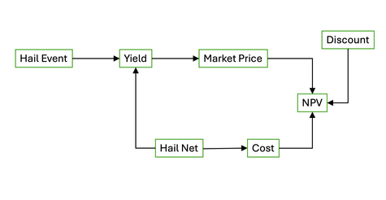

## Seminar 11: Model forecasts {#forecasts_seminar} 
<!-- reference with [Model forecasts](#forecasts_seminar) -->

Welcome to eleventh seminar of **Decision Analysis and Forecasting for Agricultural Development**.Feel free to bring up any questions or concerns in the Slack or to [Dr. Cory Whitney](mailto:cory.whitney@uni-bonn.de?subject=[Seminar_9]%20Decision%20Analysis%20Lecture) or the course tutor.

Review the process in the [Models](#model_share_seminar) lecture. 

### Building a decision model as an R function

We have already built some simple models in the [Decision Models](#decision_models) lecture and the [Model programming](#model_programming) seminar. Now we can explore another simple model with `decisionSupport`. 

### Building a model for hail nets



This model adapted from Rojas et al. (2021) represents the decision of cherry farmers in Chile to adopt hail nets. 


<!-- ### Plot the impact pathway -->

<!-- Let's use the `graph.formula` function from the `igraph` library again [@igraph2006]. This time to create the graphical impact pathway of an investment into hail nets. Add another factor called 'Discount' that impacts the Net Present Value (NPV) value. -->

<!-- ```{r igraph-example, exercise=TRUE} -->
<!-- hail_path <- graph.formula(HailNet -+ Yield,  -->
<!--                           HailNet -+ Cost,  -->
<!--                           HailEvent -+ Yield, -->
<!--                           Yield -+ MarketPrice,  -->
<!--                           MarketPrice -+ NPV, -->
<!--                           Cost -+ NPV) -->

<!-- plot(hail_path) -->
<!-- ``` -->

<!-- ```{r igraph-example-solution} -->
<!-- hail_path <- graph.formula(HailNet -+ Yield,  -->
<!--                           HailNet -+ Cost,  -->
<!--                           HailEvent -+ Yield, -->
<!--                           Yield -+ MarketPrice,  -->
<!--                           MarketPrice -+ NPV, -->
<!--                           Cost -+ NPV, -->
<!--                           Discount -+ NPV) -->

<!-- plot(hail_path) -->
<!-- ``` -->

<!-- That was just one of many ways to generate visual impact pathways. To see more options see the [Decision Analysis Overview](#decision_analysis) lecture materials. -->

Here we generate an input table to feed the hail model function. Update this with a new management cost variable shown in the graphical impact pathway. Call your new variable `"p_hail"`, make the lower bound `0.02` and the upper bound `0.2`, make the distribution `"posnorm"`, make the label `"% chance hail"` and make the description `"Probability of a hail storm"`.

```{r hail_input_table, exercise=TRUE}
hail_estimates <- data.frame(variable = c("yield", 
                                           "var_CV", 
                                           "initial_investment", 
                                           "price"),
                    lower = c(6000, 20, 500, 5),
                    median = NA,
                    upper = c(14000, 20, 1000, 80),
                    distribution = c("posnorm", 
                                     "const", 
                                     "posnorm", 
                                     "posnorm"),
                    label = c("Yield (kg/ha)", 
                              "Coefficient of variation", 
                              "Investment cost (USD)", 
                              "Market price (EUR/kg)"),
                    Description = c("Yield under normal conditions",
                                    "Coefficient of variation (measure of relative variability)",
                                    "Investment cost", 
                                    "Market price achieved for yields (EUR/kg)"))

hail_estimates
```

```{r hail_input_table-solution}
hail_estimates <- data.frame(variable = c("yield", 
                                           "var_CV", 
                                           "initial_investment", 
                                           "price", 
                                           "p_hail"),
                    lower = c(6000, 20, 500, 5, 0.02),
                    median = NA,
                    upper = c(14000, 20, 1000, 80, 0.2),
                    distribution = c("posnorm", 
                                     "const", 
                                     "posnorm", 
                                     "posnorm",
                                     "posnorm"),
                    label = c("Yield (kg/ha)", 
                              "Coefficient of variation", 
                              "Investment cost (USD)", 
                              "Market price (EUR/kg)", 
                              "% chance hail"),
                    Description = c("Yield under normal conditions",
                                    "Coefficient of variation (measure of relative variability)",
                                    "Investment cost", 
                                    "Market price achieved for yields (EUR/kg)", 
                                    "Probability of a hail storm"))

hail_estimates
```

Here we create a function following the graphical impact pathway and using the inputs above to calculate the Net Present Value for the investment in hail nets. We use the `vv()` function from the `decisionSupport` package to add more variation over time [@R-decisionSupport]. We also use the `chance_event()` function to calculate a `hail_adjusted_yield` for losses when there is hail. 

```{r hail-model, exercise=TRUE}
hail_function <- function(){
  
# use vv() to add variability to the 
# random draws of yield and of  price 
# over a 20 year simulation 
yields <- vv(var_mean = yield, 
             var_CV = var_CV, 
             n = 20)

prices <- vv(var_mean = price, 
             var_CV = var_CV, 
             n = 20)

# use rep() to simulate the initial_investment 
# only in the first year (assuming the net lasts 20 years)
invest_costs <- c(initial_investment, rep(0, 19))

# use p_hail in the chance_event() 
# to adjust yield for probability of hail
# assuming no yield at all in the event of hail
hail_adjusted_yield <- chance_event(chance = p_hail, 
                                    value_if = 0,
                                    value_if_not = yield,
                                    n = 20)

# calculate profit without net
profit_no_net <- hail_adjusted_yield*prices

# calculate profit with the net
profit_with_net <- (yields*prices)-invest_costs

# use 'discount' to calculate net present value 
# 'discount_rate' is expressed in percent
NPV_no_net <- discount(profit_no_net, discount_rate = 5, calculate_NPV = TRUE)
NPV_net <- discount(profit_with_net, discount_rate = 5, calculate_NPV = TRUE)

# calculate the overall NPV of the decision (do - don't do)
NPV_decision <- NPV_net - NPV_no_net

return(list(NPV_no_net =  NPV_no_net,
            NPV_net =  NPV_net, 
            NPV_decision = NPV_decision))
}

```

We can use the `mcSimulation()` function from the `decisionSupport` package to implement a model [@R-decisionSupport].

```{r hail-model-run, exercise=TRUE}
# Run the Monte Carlo simulation using the model function
hail_mc_simulation <- mcSimulation(estimate = as.estimate(hail_estimates),
                              model_function = hail_function,
                              numberOfModelRuns = 200,
                              functionSyntax = "plainNames")

hail_mc_simulation
```

Here we show the results of a Monte Carlo simulation (200 model runs) for estimating the comparative profits with and without hail nets. 

```{r hail_plot_distribution, exercise=TRUE}
plot_distributions(mcSimulation_object = hail_mc_simulation, 
                      vars = c("NPV_no_net", "NPV_net"),
                      method = 'smooth_simple_overlay', 
                      base_size = 7)
```

#### Value of Information (VoI) analysis

Calculate Value of Information (VoI) analysis with the Expected Value of Perfect Information (EVPI). As we learned in [Lecture 8 on forecasts](#forecasts), EVPI helps us determine if more research will be helpful in understanding the expected change in the value of a decision outcome through reducing uncertainty on a given variable. 

Use the function `data.frame()` to transform the x and y outputs of the `mcSimulation()` function results for EVPI calculation. We use the `multi_EVPI()` function to calculate the EVPI for multiple independent variables. For the first_out_var argument we choose `NPV_decision` from the input table since this is the first output variable (the only variable) and will the subject of the EVPI. 

```{r hail-evpi, exercise=TRUE}
# subset the outputs from the mcSimulation function (y) 
# to run the multi_EVPI only on the variables that the we want 
# (i.e. the NPV_decision)
mcSimulation_table_hail <- data.frame(hail_mc_simulation$x, 
                                 hail_mc_simulation$y[3])

evpi_hail <- multi_EVPI(mc = mcSimulation_table_hail, 
                   first_out_var = "NPV_decision")
```

We use the function `plot_evpi()` on the results from `multi_EVPI()` to plot the Expected Value of Perfect Information (EVPI). Here we show the results with the standard settings. The length of the bars is equal to EVPI.

```{r hail-evpi_plot, exercise=TRUE}
plot_evpi(evpi_hail, decision_vars = "NPV_decision")
```

### Next steps

Once you have followed and run the code above on your machine it is a good time to look through the outline of these procedures in the example by @lanzanova_improving_2019 called ['Sediment management in a reservoir in Burkina Faso'](http://htmlpreview.github.io/?https://github.com/CWWhitney/BurkinaExample/blob/master/Burkina_vignette.html). It runs a Monte-Carlo-based selection of sedimentation management strategies for a reservoir in the Upper Volta River Basin of Burkina Faso [@lanzanova_improving_2019]. 

*Tip*: If you want to play with this code you can find the [Rmarkdown file](https://raw.githubusercontent.com/CWWhitney/17_Burkina_Vignette/blob/master/Burkina_vignette.Rmd) and the [estimate table](https://raw.githubusercontent.com/CWWhitney/BurkinaExample/master/Sediment_input_table.csv) in the GitHub repository. 

### Bonus: Bayesian links

Follow [Chelsea Parlett Pelleriti's Bayesian statistics work](https://cmparlettpelleriti.github.io/)

Listen to the ['Learning Bayesian Statistics'](https://www.learnbayesstats.com) podcast

Follow [Michael Betancourt’s Bayesian statistics work](https://betanalpha.github.io/)

<!-- -	Rainforth, Tom. “Automating Inference, Learning, and Design Using Probabilistic Programming.” Doctor of Philosophy, University of Oxford, 2017. -->

### References

Rojas, Gonzalo, Eduardo Fernandez, Cory Whitney, Eike Luedeling, and Italo F. Cuneo. “Adapting Sweet Cherry Orchards to Extreme Weather Events – Decision Analysis in Support of Farmers’ Investments in Central Chile.” Agricultural Systems 187 (February 2021): 103031. https://doi.org/10.1016/j.agsy.2020.103031.