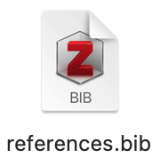

## Seminar 12: Citation management {#writing}
<!-- [Academic writing part 2](#citations) -->

Welcome to the 12th seminar of **Decision Analysis and Forecasting for Agricultural Development**. Feel free to bring up any questions or concerns in the Slack or to [Dr. Cory Whitney](mailto:cory.whitney@uni-bonn.de?subject=%5BSeminar_10%5D%20Decision%20Analysis%20Lecture) or the course tutor.

In this seminar, we will discuss how to use Zotero for citations in RMarkdown. If you use an alternative reference management system, you are encouraged to find out how to use it with RMarkdown. However, in this course let's work with Zotero.

Let's start by downloading and installing Zotero.

**1.  Install Zotero :**

-   If you haven't used Zotero, please download and install Zotero from [zotero.org](https://www.zotero.org/).

**2.  Export your Zotero library to a .bib file**:

-   Open Zotero.
-   Go to `File`, select `Export Library` and choose the `BibTeX` format. <br>

{width="70%"}

-   Save the exported .bib file {width="15%"} to your project directory.

**3.  Add the .bib file to your RMarkdown document**:

-   In your RMarkdown document, specify the path to the .bib file using the `bibliography` field in the YAML header.
-   Optionally, include a `csl` field if you want to use a specific citation style. Different citation styles can be downloaded from [Citation Style Language](https://www.zotero.org/styles). Save the exported csl file to your project directory.

**4.  Cite references in your RMarkdown document**:

-   Use `[@citation_key]` to cite references within the text.

Here's an example of how to set this up in an RMarkdown document:

```         
---
title: "Your Document Title"
author: "Your Name"
date: "`r Sys.Date()`"
output:
  pdf_document: default
  html_document: default
bibliography: references.bib
csl: nature.csl  # Optional, specify a citation style
---

# Introduction
This is an example of citing a reference [@author2020].
# Method
Describe your method here.
# Results
Present your results here.
# Conclusion
Conclude your document here.
# References
```
