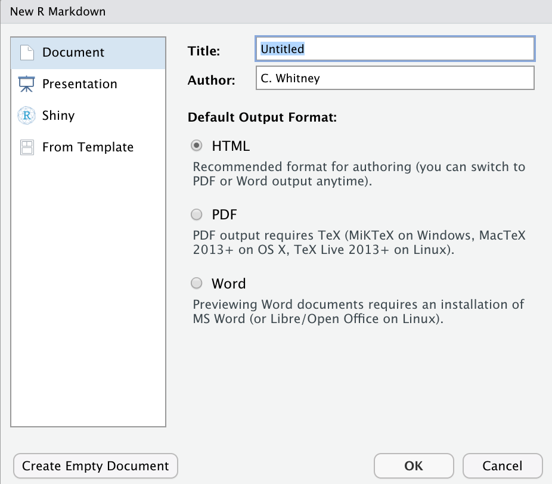
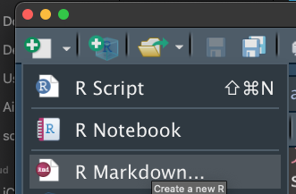
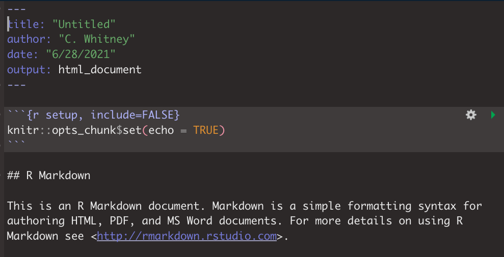

## Seminar 12: Academic Writing {#writing} 
<!-- [Academic writing](#writing) -->

Welcome to the 12th seminar of **Decision Analysis and Forecasting for Agricultural Development**. Feel free to bring up any questions or concerns in the Slack or to [Dr. Cory Whitney](mailto:cory.whitney@uni-bonn.de?subject=[Seminar_10]%20Decision%20Analysis%20Lecture) or the course tutor.

In this seminar we will build on some of the things we learned in the [Using RMarkdown](#rmarkdown) seminar. We will use [Rmarkdown](https://rmarkdown.rstudio.com/) [@R-rmarkdown] to create a report on our R code. 

To run this you will need to load `library(rmarkdown)` and library(`knitr`).  

<!-- https://youtu.be/wg8PjkOxD4Y -->

<iframe width="560" height="315" src="https://www.youtube.com/embed/wg8PjkOxD4Y" frameborder="0" allowfullscreen></iframe>

Find the RMD file and bib files referenced in the video in the [RMarkdown_template Git repository]( https://github.com/CWWhitney/RMarkdown_template). 

- Open an Rmarkdown file

- Open an Rmarkdown file

### Yet Another Markup Language

- When you open an Rmarkdown file you get a default document with examples and also with the standard setting, as we discussed in the [Using RMarkdown](#rmarkdown) seminar. the top of the document contains information between three dashed lines like this `---`. The language within these marks is known as YAML and sets the general layout and format of your document. 

### Reuse chunk options

In case of repeated formatting in different code chunks we can use the `knitr` `opts.label` option to reuse what we wrote and avoid repetition (@R-knitr). Following the [Don’t Repeat Yourself (DRY) principle](https://yihui.org/en/2021/05/knitr-reuse/).

<!-- ### Transparent Data Sharing -->

<!-- <!-- https://youtu.be/jFwnIihK3aw -->

<!-- <iframe width="560" height="315" src="https://www.youtube.com/embed/jFwnIihK3aw" frameborder="0" allowfullscreen></iframe> -->

<!-- The video for the @ruett_model-based_2020 paper and the supplementary materials by @ruett_data_2021 are in the references.  -->

### Hosting an html

You can host your html files in your github repository with the `htmlpreview.github.io` tools. 

The website hosting the raw html file for this course is: 

`http://htmlpreview.github.io/?https://github.com/CWWhitney/Decision_Analysis_Course/blob/main/Index.html`

This works with the `htmlpreview.github.io` by taking adding `http://htmlpreview.github.io/?` to the first part of the link to the html file in an open access github repository `https://github.com/CWWhitney/Decision_Analysis_Course/blob/main/Index.html`.

